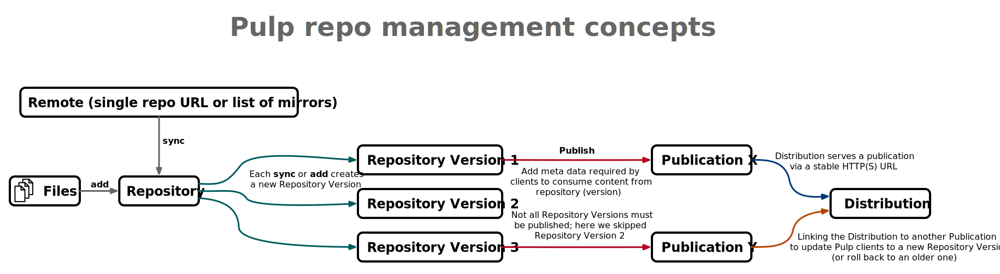

# Configuring a Pulp server for repository management #

Table of Contents:

* [Intro](#-intro): About Pulp, concepts and documentation.
* [Create Server](#-create-server): Create VM for Pulp with Ansible.
* [Install and configure with Ansible](#-install-and-configure-with-ansible): Deploy Pulp & configure repositories both with Ansible.
* [Configure manually with API](#-configure-manually-with-api): configure repositories manually using the Pulp API.

---

# <a name="Intro"/> Intro

We use [Pulp](https://pulpproject.org/) for repository management: caching and versioning of _artifacts_ like _RPMs_
to make sure we can install a specific version of packages and hence recreate a machine in a specific state.

Pulp can manage different types of _artifacts/repos_ using plug-ins. E.g. for _RPMs_, _Ansible roles_, _Python Packages_, etc.
So far we use Pulp only for _RPMs_, so we need (the documentation for) the _**Pulp core framework**_ and the _**Pulp RPM plug-in**_.


### Pulp Concepts:

 

Pulp uses the following concepts:

1. _**Repository**_:
   A collection of _artifacts_.
2. _**Remote**_:
   A repository can be synced with an upstream _remote_
3. _**Repository Version**_:
   A new immutable version is created ach time a _repo_ gets modified.
   (E.g. add content / delete content / sync with a _remote_)
4. _**Publication**_:
   A _publication_ is a _repository version_ + metadata required by clients
   in order to be able to consume the content from that _repo version_.
   E.g. manifest files, indices, etc.
5. _**Distribution**_:
   Is a location/URL where a _publication_ is served to clients usually over HTTP(S).

### Pulp Components

A Pulp server consists of 3 components:

 * REST API (a Django application running under a WSGI server)
 * Content serving application (An aiohttp.server based application)
 * Tasking system ([Redis Queue](https://python-rq.org/), which provides a _resource manager_ and _workers_)

### Users and authentication

Three different users are required for a complete Pulp installation.

1. _**repo\_management\_user**_  
   This is a Linux user/account.
   Users in the Linux admin group can sudo to this user to manage Pulp manually.
   E.g. create/update/delete artifacts, repositories, remotes, publications and distributions.
2. _**pulp\_api\_user**_  
   This is the account used by the *repo_management_user* to login to the Pulp API to work with Pulp.
   The pulp_api_password is for this account.
3. _**pulp\_user**_:  
   This is a Linux user/account, which is used to run the Pulp daemons/services.
   This is configured in the pulp.pulp_installer.pulp_all_services role our pulp_server role depends on.
   The default *pulp_user* is _**pulp**_

The pulp_api_user and pulp_api_password are only used to secure the API.

 * The *pulp_api_user* must be _**admin**_ in Pulp 3.
 * The *pulp_api_password* will be configured by the pulp-installer upon initial configuration with an Ansible playbook.
   The pulp-intaller will **not** update a password though. Use the ```pulpcore-manager``` command to change the admin password:
   ```bash
   /usr/local/bin/pulpcore-manager reset-admin-password -p [password]
   ```

In theory you can require clients that want to fetch artifacts (like RPMs) from a Pulp server to authenticate to Pulp,
but we don't require clients to authenticate.

The *pulp_secret* is used by the Django app too; for "Any usage of cryptographic signing, unless a different key is provided."

### For admins: API only

Pulp started as API only. There is a command line interface (CLI) in beta, but there is no GUI.
Other projects like Katello provide GUIs for Pulp. We don't use any GUI on top of Pulp to keep deployment as simple as possible;
it has enough dependencies already.

### Pulp uses storage efficiently

 * Multiple _distributions_ and _publications_ and _repository versions_ may have the same version of an _artifact_,
   which is stored only once.
 * You can save on storage by using `policy='on_demand'` for remotes.
   This means that Pulp will only fetch the meta-data for artifacts when a repository is synchronized with that remote.
   The artifacts themselves will only get fetched from the remote when a client requests them.

### Additional tooling

 * [Pulp CLI](https://github.com/pulp/pulp-cli): Pulp command line interface.
 * [Pulp Installer](https://github.com/pulp/pulp_installer): Ansible roles to install or upgrade a Pulp 3 server.
 * [Pulp Squeezer](https://github.com/pulp/squeezer): Ansible collection to manage repos on a Pulp 3 server.

### Documentation

 * Pulp core docs https://docs.pulpproject.org/pulpcore/index.html
 * Pulp RPM docs  https://docs.pulpproject.org/pulp_rpm/index.html
 * Pulp core API  https://docs.pulpproject.org/pulpcore/restapi.html
 * Pulp RPM API   https://docs.pulpproject.org/pulp_rpm/restapi.html
 * Pulp RPM API example scripts: https://github.com/pulp/pulp_rpm/tree/master/docs/_scripts
 * Pulp Installer docs https://pulp-installer.readthedocs.io/en/latest/
 * Pulp Squeezer docs are not online (yet). You will need to look at the code  
   either in GitHub: https://github.com/pulp/squeezer
   or once you have this Ansible collection installed from the commandline using: `ansible-doc pulp.squeezer.<module_name>`
 
# <a name="Create-Server"/> Create Server

### Use deploy-os_server.yml playbook

The `deploy-os_server.yml` playbook can be used to create all VMs for a cluster including a repo server.
This playbook requires the _OpenStack SDK_ to be installed and configured on your _Ansible control host_;
See the `README.md` in the root of this repo for details.

# <a name="Install-And-Configure-With-Ansible"/> Install and configure with Ansible

### Using the pulp_server role

Make sure the requirements/dependencies from Ansible Galaxy were installed.
The exec summary:
```bash
ansible-galaxy install -r galaxy-requirements.yml
```
See the `README.md` in the root of this repo for details.
Next you can use
```bash
. ./lor-init
lor-config [name-of-the-cluster]
ansible-playbook -i inventory.py -u [admin_account] single_role_playbooks/pulp_server.yml
```
This will install Pulp, create an admin account to manage Pulp and install the Pulp CLI in a Python virtual environment
for that admin account. It will also do part of the initial configuration, but this is incomplete due to missing features in _Pulp Squeezer_;
the *pulp_server* role can create _remotes_ and _repositories_, but it cannot associate a _remote_ with a _repository_ yet.
Furthermore the role cannot know when you want to sync a _repo_ with a _remote_ to update content.

### Manual work following the pulp_server role

For the `pulpcore` version `3.12.2` and `pulp-rpm` version `3.10.0` you need to downgrade the package `productmd` to version `1.32` due to the [known bug](https://pulp.plan.io/issues/8825)

```bash
[root @ reposrv ] # cd /usr/local/lib/pulp/
[root @ reposrv ] # source bin/activate
[root @ reposrv ] # pip install 'productmd==1.32' --force-reinstall
[root @ reposrv ] # shutdown -r now
```
And then check for core and plugin versions

```bash
[ repoadmin @ reposrv ] $ pulp status
...
- component: core
  version: 3.12.2
- component: rpm
  version: 3.10.0
- component: file
  version: 1.7.0
```

The following steps must be performed manually for now:

 * Add content (RPMs) to a _repository_ for the ones without _remote_.
 * Add a _remote_ to a _repository_.
 * Sync a _repository_ with a _remote_.
 * Create a new _publication_ for a _repository version_.
 * Create a new _distribition_ for a _publication_.
 * Update the _publication_ for an existing _distribition_.

You can use

 * Either Pulp CLI commands where possible (easier and recommended)
 * Or send raw HTTP GET/PUT calls to the Pulp API using a commandline HTTP client like HTTPie or cURL
   (harder, but required where Pulp CLI support is incomplete).

See the example commands below for what was initially configured manually for the ```nb-repo``` Pulp server.

# <a name="Configure-Manually-With-Api"/> Configure manually with API

Below are notes from manual installation and configuration of the ```nb-repo``` Pulp server.
These can be used as __examples__, but should not be used unmodified as a step by step guide.
Note that part of what is listed below is now already configured with _Pulp Squeezer_ by the ```pulp_server``` _role_.

### Install Pulp-CLI and other tools.

```
#
# Root user
#
ssh tunnel+nb-repo
sudo su

yum install nano
yum install httpie
yum install jq
yum install curl # already present

#
# Admin user
#
ssh tunnel+nb-repo

#
# repo_management_user is configured
#   * either in roles/pulp_server/defaults/main.yml
#   * or overruled in group_vars/[name-of-the-cluster]_cluster/vars.yml
#
sudo -u ${repo_management_user}
touch -m 600 ~/.netrc
nano -w ~/.netrc

#### Add:
# machine localhost
# login admin
# password *****

#
# Create Python3 virtual env for pulp-cli
#
python3 -m venv pulp-cli.venv
source pulp-cli.venv/bin/activate
pip3 install pulp-cli[pygments]
#
# Configure pulp-cli
#
pulp config create --base-url "http://localhost"
# or
pulp config create -e  # with an editor (e.g. vim)
# or
pulp config create -i  # interactive prompts
#
# Inspect and validate generated config.
#
cat ~/.config/pulp/settings.toml
pulp config validate --strict
```

### Manual configuration with pulp CLI (beta)

```
pulp status
pulp rpm repository list

#
# Create remotes.
#
pulp rpm remote create --tls-validation false --policy on_demand --name centos7-base-remote    --url http://mirror.centos.org/centos/7/os/x86_64/
pulp rpm remote create --tls-validation false --policy on_demand --name centos7-updates-remote --url http://mirror.centos.org/centos/7/updates/x86_64/
pulp rpm remote create --tls-validation false --policy on_demand --name centos7-extras-remote  --url http://mirror.centos.org/centos/7/extras/x86_64/
pulp rpm remote create                        --policy on_demand --name epel7-remote           --url https://download.fedoraproject.org/pub/epel/7/x86_64/
pulp rpm remote create                        --policy on_demand --name irods7-remote          --url https://packages.irods.org/yum/pool/centos7/x86_64/
pulp rpm remote create                        --policy on_demand --name lustre7-remote         --url https://downloads.whamcloud.com/public/lustre/latest-release/el7/client/
#
# Create repos linked to remotes where available.
# CPEL = Custom Packages for Enterprise Linux == our own repo without remote.
#
pulp rpm repository create --name centos7-base    --remote centos7-base-remote
pulp rpm repository create --name centos7-updates --remote centos7-updates-remote
pulp rpm repository create --name centos7-extras  --remote centos7-extras-remote
pulp rpm repository create --name epel7           --remote epel7-remote
pulp rpm repository create --name cpel7           # does not have a remote
pulp rpm repository create --name irods7          --remote irods7-remote
pulp rpm repository create --name lustre7         --remote lustre7-remote
#
# Sync repos using remotes creating new repository versions.
# Note: first version was "0"; this sync creates version "1".
#
pulp rpm repository sync --name centos7-base
pulp rpm repository sync --name centos7-updates
pulp rpm repository sync --name centos7-extras
pulp rpm repository sync --name epel7
pulp rpm repository sync --name irods7
pulp rpm repository sync --name lustre7
#
# Add RPMs to CPEL repo.
#
# Downloaded some, but not all previously created RPMs from deprecated Spacewalk repo server.
# Next, upload them to the the new nb-repo server:
#
[on remote machine]> rsync -av umcg-centos7 pieter@tunnel+nb-repo:
for rpm in $(ls -1 umcg-centos7/*.rpm); do
    echo "Uploading RPM ${rpm} to pulp creating a new artifact ..."
    pulp artifact upload --file "${rpm}"
done
#
# pulp-cli does not have commands yet to create RPM content from artifacts and add them to a repo.
# So we have to manually create HTTP POST/PUT/GET calls using the example code/scripts described at
# https://docs.pulpproject.org/pulp_rpm/index.html 
#
export BASE_ADDR='http://localhost:24817'
# Poll a Pulp task until it is finished.
wait_until_task_finished() {
    echo "Polling the task until it has reached a final state."
    local task_url=$1
    while true
    do
        response=$(http "$task_url")
        local response
        state=$(jq -r .state <<< "${response}")
        local state
        jq . <<< "${response}"
        case ${state} in
            failed|canceled)
                echo "Task in final state: ${state}"
                exit 1
                ;;
            completed)
                echo "$task_url complete."
                break
                ;;
            *)
                echo "Still waiting..."
                sleep 1
                ;;
        esac
    done
}
declare -A custom_rpms=(
    ['ega-fuse-client-2.0.0-1.noarch.rpm']='/pulp/api/v3/artifacts/5936701f-e661-4a03-8841-4073a84b7760/'
    ['lbnl-nhc-1.4.2-1.el7.noarch.rpm']='/pulp/api/v3/artifacts/9a0da51c-91aa-4786-89f0-8a2f0f7c4407/'
    ['python36-sshpubkeys-3.1.0-1.el7.noarch.rpm']='/pulp/api/v3/artifacts/3ad45a5f-7bfc-4f90-beb6-c9e2eb2e580f/'
    ['slurm-18.08.8-1.el7.umcg.x86_64.rpm']='/pulp/api/v3/artifacts/cd35f438-f04e-4de4-ac8e-fa3572842534/'
    ['slurm-contribs-18.08.8-1.el7.umcg.x86_64.rpm']='/pulp/api/v3/artifacts/02cc0f45-84d2-4a8d-b53a-5a45a302ca3f/'
    ['slurm-devel-18.08.8-1.el7.umcg.x86_64.rpm']='/pulp/api/v3/artifacts/a846d5b0-6a35-423a-a232-b402e2ae5d2c/'
    ['slurm-example-configs-18.08.8-1.el7.umcg.x86_64.rpm']='/pulp/api/v3/artifacts/dce46c7c-fa4a-4579-bbd0-3732c60d74f1/'
    ['slurm-libpmi-18.08.8-1.el7.umcg.x86_64.rpm']='/pulp/api/v3/artifacts/fc803a7f-0cb8-412a-8039-e7f1ace95f23/'
    ['slurm-openlava-18.08.8-1.el7.umcg.x86_64.rpm']='/pulp/api/v3/artifacts/0bef567f-a9d4-4e74-a42d-ca1f73999739/'
    ['slurm-pam_slurm-18.08.8-1.el7.umcg.x86_64.rpm']='/pulp/api/v3/artifacts/a3bce064-e906-4c65-b0fc-75e408897f3e/'
    ['slurm-perlapi-18.08.8-1.el7.umcg.x86_64.rpm']='/pulp/api/v3/artifacts/57869fa8-4bfd-4752-b6fe-d211f6b17889/'
    ['slurm-slurmctld-18.08.8-1.el7.umcg.x86_64.rpm']='/pulp/api/v3/artifacts/e5b00efb-5510-415d-b05d-fe98cec18793/'
    ['slurm-slurmd-18.08.8-1.el7.umcg.x86_64.rpm']='/pulp/api/v3/artifacts/be2e01a6-7174-409d-b14e-ea8d13c68ab0/'
    ['slurm-slurmdbd-18.08.8-1.el7.umcg.x86_64.rpm']='/pulp/api/v3/artifacts/be77040b-683b-4308-8303-2c045adf8e4a/'
    ['slurm-torque-18.08.8-1.el7.umcg.x86_64.rpm']='/pulp/api/v3/artifacts/c6488d4c-2910-48f9-af12-5d5928acfae6/'
)
for custom_rpm in "${!custom_rpms[@]}"; do
    # Create RPM package from an artifact
    echo "Create RPM ${custom_rpm} from artifact ${custom_rpms[${custom_rpm}]}."
    TASK_URL=$(http POST "$BASE_ADDR"/pulp/api/v3/content/rpm/packages/ \
        artifact="${custom_rpms[${custom_rpm}]}" relative_path="${custom_rpm}" | jq -r '.task')
    # Poll the task (here we use a function defined in docs/_scripts/base.sh)
    wait_until_task_finished "$BASE_ADDR""$TASK_URL"
    # After the task is complete, it gives us a new package (RPM content)
    echo "Set PACKAGE_HREF from finished task."
    PACKAGE_HREF=$(http "$BASE_ADDR""$TASK_URL"| jq -r '.created_resources | first')
    echo "Inspecting Package."
    http "$BASE_ADDR""$PACKAGE_HREF"
done
declare -A custom_rpms=(
    ['ega-fuse-client-2.0.0-1.noarch.rpm']='/pulp/api/v3/content/rpm/packages/1de72eb4-ed38-4d58-aeaf-43d8b8cf8912/'
    ['lbnl-nhc-1.4.2-1.el7.noarch.rpm']='/pulp/api/v3/content/rpm/packages/8b0b5382-8d4d-430b-8923-5d9d5a2a2dcf/'
    ['python36-sshpubkeys-3.1.0-1.el7.noarch.rpm']='/pulp/api/v3/content/rpm/packages/a52cfad4-2666-48de-83ec-9666b3fd3735/'
    ['slurm-18.08.8-1.el7.umcg.x86_64.rpm']='/pulp/api/v3/content/rpm/packages/38595711-199f-4c8c-9449-afef7482156f/'
    ['slurm-contribs-18.08.8-1.el7.umcg.x86_64.rpm']='/pulp/api/v3/content/rpm/packages/f95deeea-c7e4-4010-92cd-71deb45dbfc7/'
    ['slurm-devel-18.08.8-1.el7.umcg.x86_64.rpm']='/pulp/api/v3/content/rpm/packages/b74102a6-6655-4909-8111-79eaa8aa1a59/'
    ['slurm-example-configs-18.08.8-1.el7.umcg.x86_64.rpm']='/pulp/api/v3/content/rpm/packages/579cbf1c-40e1-49e1-b616-5c14db1bb9de/'
    ['slurm-libpmi-18.08.8-1.el7.umcg.x86_64.rpm']='/pulp/api/v3/content/rpm/packages/719d8332-f834-4bcf-8912-a0733efe0fe5/'
    ['slurm-openlava-18.08.8-1.el7.umcg.x86_64.rpm']='/pulp/api/v3/content/rpm/packages/2a9428a0-ba96-4f6c-8ea1-bb2ca38bbb20/'
    ['slurm-pam_slurm-18.08.8-1.el7.umcg.x86_64.rpm']='/pulp/api/v3/content/rpm/packages/32daf7cd-bfa8-4571-ab78-64d3d57b47f9/'
    ['slurm-perlapi-18.08.8-1.el7.umcg.x86_64.rpm']='/pulp/api/v3/content/rpm/packages/b564c4a1-55d7-436b-a2b2-72d493b417df/'
    ['slurm-slurmctld-18.08.8-1.el7.umcg.x86_64.rpm']='/pulp/api/v3/content/rpm/packages/7fdf09a6-4366-4cde-a305-06f61c1b1c34/'
    ['slurm-slurmd-18.08.8-1.el7.umcg.x86_64.rpm']='/pulp/api/v3/content/rpm/packages/c24be61e-84c4-4795-bd4b-dec94665c25c/'
    ['slurm-slurmdbd-18.08.8-1.el7.umcg.x86_64.rpm']='/pulp/api/v3/content/rpm/packages/d50fb95f-99d3-47fe-ad4c-d07d890bded3/'
    ['slurm-torque-18.08.8-1.el7.umcg.x86_64.rpm']='/pulp/api/v3/content/rpm/packages/7355adc6-eeea-4ce2-becc-783f634b4fcc/'
)
REPO_HREF='/pulp/api/v3/repositories/rpm/rpm/7a796372-6b2e-4d70-a3c6-8c17b8deb608/'
for custom_rpm in "${!custom_rpms[@]}"; do
    # Add created RPM content to repository
    echo "Add created RPM Package ${custom_rpm} to repository."
    TASK_URL=$(http POST "$BASE_ADDR""$REPO_HREF"'modify/' \
        add_content_units:="[\"${custom_rpms[${custom_rpm}]}\"]" | jq -r '.task')
    # Poll the task (here we use a function defined in docs/_scripts/base.sh)
    wait_until_task_finished "$BASE_ADDR""$TASK_URL"
done
#
# Inspect repository versions
#
pulp rpm repository version list --repository centos7-base
pulp rpm repository version list --repository centos7-updates
pulp rpm repository version list --repository centos7-extras
pulp rpm repository version list --repository epel7
pulp rpm repository version list --repository cpel7
pulp rpm repository version list --repository irods7
#
# Create new publications based on new repository versions.
#
# Optionally specify specific version number with --version
#
pulp rpm publication create --repository centos7-base     --version 1
pulp rpm publication create --repository centos7-updates  --version 1
pulp rpm publication create --repository centos7-extras   --version 1
pulp rpm publication create --repository epel7            --version 1
pulp rpm publication create --repository cpel7            --version 15
pulp rpm publication create --repository irods7           --version 1
#
# List repos and publications to figure out which publication HREF matches which repo.
#
pulp rpm repository list
pulp rpm publication list
#
# Create distributions to serve the publications to clients.
#
pulp rpm distribution create --name nb-centos7-base    --base-path nibbler/centos7-base    --publication /pulp/api/v3/publications/rpm/rpm/92c4f247-1527-40e2-b2ab-63891a7448e4/
pulp rpm distribution create --name nb-centos7-updates --base-path nibbler/centos7-updates --publication /pulp/api/v3/publications/rpm/rpm/068e3066-3559-4d00-949f-8ee422005556/
pulp rpm distribution create --name nb-centos7-extras  --base-path nibbler/centos7-extras  --publication /pulp/api/v3/publications/rpm/rpm/a288bd3e-fdfc-453c-a8a3-b7ae0398d1f5/
pulp rpm distribution create --name nb-epel7           --base-path nibbler/epel7           --publication /pulp/api/v3/publications/rpm/rpm/6718163f-4a97-46c8-ae08-7f538885da9f/
pulp rpm distribution create --name nb-cpel7           --base-path nibbler/cpel7           --publication /pulp/api/v3/publications/rpm/rpm/0e7c5260-522b-42f5-af63-e3f35312a036/
pulp rpm distribution create --name nb-irods7          --base-path nibbler/irods7          --publication /pulp/api/v3/publications/rpm/rpm/a9da6d50-043b-4f7a-b898-2c78553cd7b0/
#
# List distributions to get the URLs for the clients.
#
pulp rpm distribution list
#
# https://nb-repo/pulp/content/nibbler/centos7-base/
# https://nb-repo/pulp/content/nibbler/centos7-updates/
# https://nb-repo/pulp/content/nibbler/centos7-extras/
# https://nb-repo/pulp/content/nibbler/epel7/
# https://nb-repo/pulp/content/nibbler/cpel7/
# https://nb-repo/pulp/content/nibbler/irods7/
#
# Download the config.repo file from the server at distribution’s base_path and store it in /etc/yum.repos.d:
#
http --verify no https://nb-repo/pulp/content/nibbler/centos7-base/config.repo    > centos7-base.repo 
http --verify no https://nb-repo/pulp/content/nibbler/centos7-updates/config.repo > centos7-updates.repo 
http --verify no https://nb-repo/pulp/content/nibbler/centos7-extras/config.repo  > centos7-extras.repo 
http --verify no https://nb-repo/pulp/content/nibbler/epel7/config.repo           > epel7.repo 
http --verify no https://nb-repo/pulp/content/nibbler/cpel7/config.repo           > cpel7.repo 
#
# Cleanup to remove RPMs no longer used by any repo version / publication.
# E.g. after deleting a repo (version).
#
pulp orphans delete
#
# Pulp does not restart anymore, because the RPMs added to our cpel7 repo only received MD5 checksums.
# The default ALLOWED_CONTENT_CHECKSUMS = ["sha224", "sha256", "sha384", "sha512"]
# Pulp also supports md5 and sha1, but those are not by default "allowed" anymore.
# This results in the error:
#     django.core.exceptions.ImproperlyConfigured: There have been identified artifacts with forbidden checksum 'md5'.
#     Run 'pulpcore-manager handle-artifact-checksums' first to unset forbidden checksums.
# ToDo need to figure out how to create the correct type of checksums when adding RPMs to our custom cpel7 repo.
# To get a report on the problematic ones:
root@nb-repo $> /usr/local/bin/pulpcore-manager handle-artifact-checksums --report
# To calculate new "allowed" checksums for the problematic ones:
root@nb-repo $> /usr/local/bin/pulpcore-manager handle-artifact-checksums
#
# Updates
#
pulp rpm repository sync --name epel7
pulp rpm publication create --repository epel7 --version 2
pulp rpm distribution show --name nb-epel7
pulp rpm distribution update --name nb-epel7 --publication /pulp/api/v3/publications/rpm/rpm/a4765571-dc89-47c3-a7d0-ed9b18fad287/
pulp rpm distribution show --name nb-epel7
```

### Manual API calls with HTTPie (http) command

```
export BASE_ADDR='http://localhost:24817'
export CONTENT_ADDR='http://localhost:24816'

#
# List repos
#
http GET "$BASE_ADDR"/pulp/api/v3/repositories/

#
# Create new RPM repo
#
http POST "$BASE_ADDR"/pulp/api/v3/repositories/rpm/rpm/ \
    name="centos7-base"

#
# Create new remote for repo based on mirror list.
#
http POST "$BASE_ADDR"/pulp/api/v3/remotes/rpm/rpm/ \
    name='centos7-base-remote' \
    url='http://mirror.centos.org/centos/7/os/x86_64/' \
    policy='on_demand' \
    tls_validation=True

#
# List remotes
#
http GET "$BASE_ADDR"/pulp/api/v3/remotes/rpm/rpm/

#
# Sync repository using remote.
#
echo "Create a task to sync the repository using the remote."
TASK_URL=$(http POST "$BASE_ADDR"'/pulp/api/v3/repositories/rpm/rpm/eb7f9dd2-c086-45b4-97fd-362e34b0b314/sync/' \
    remote='/pulp/api/v3/remotes/rpm/rpm/b5d7575d-8d73-4ea1-935d-993b8e906d87/' \
    | jq -r '.task')

#
# Poll the task (here we use a function defined in docs/_scripts/base.sh)
#
wait_until_task_finished "$BASE_ADDR""$TASK_URL"
#
# After the task is complete, it gives us a new repository version
#
echo "Set REPOVERSION_HREF from finished task."
REPOVERSION_HREF=$(http "$BASE_ADDR""$TASK_URL"| jq -r '.created_resources | first')
export REPOVERSION_HREF
echo "Inspecting RepositoryVersion."
http "$BASE_ADDR""$REPOVERSION_HREF"

#
# Create RPM publication
#
echo "Create a task to create a publication."
TASK_URL=$(http POST "$BASE_ADDR"/pulp/api/v3/publications/rpm/rpm/ \
    repository="/pulp/api/v3/repositories/rpm/rpm/eb7f9dd2-c086-45b4-97fd-362e34b0b314/" metadata_checksum_type=sha256 | jq -r '.task')
#
# Poll the task (here we use a function defined in docs/_scripts/base.sh)
#
wait_until_task_finished "$BASE_ADDR""$TASK_URL"
#
# After the task is complete, it gives us a new publication
#
echo "Set PUBLICATION_HREF from finished task."
PUBLICATION_HREF=$(http "$BASE_ADDR""$TASK_URL"| jq -r '.created_resources | first')
export PUBLICATION_HREF

echo "Inspecting Publication."
http "$BASE_ADDR""$PUBLICATION_HREF"
```
