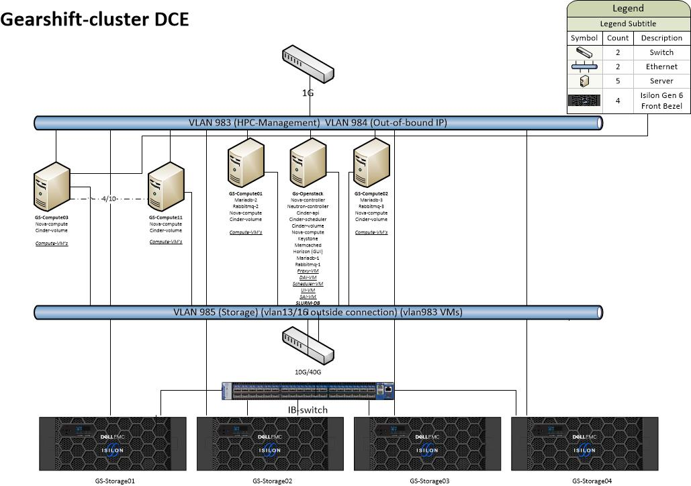
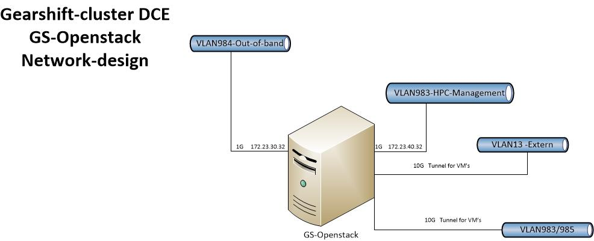
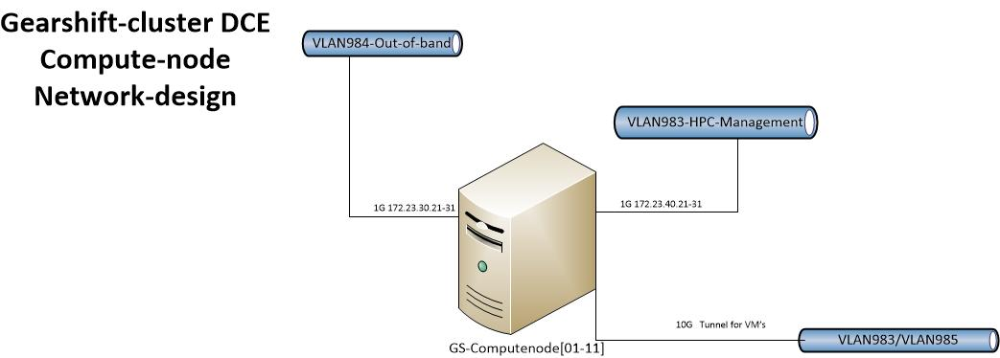
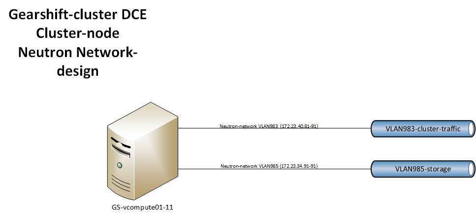
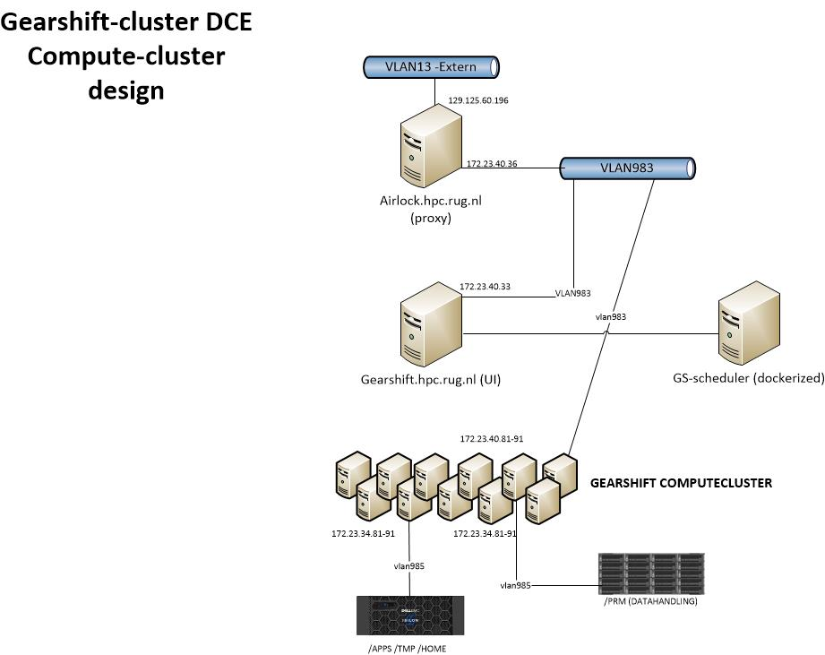
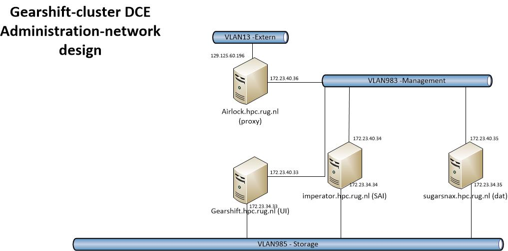

 {width="6.470138888888889in" height="0.11458333333333333in"} 
----------------------------------------------------------------------------------------------------------

Technical design HPC cluster *Gearshift*

[]{#_ocka61iarkyo .anchor}2017-10-26 • hpc-3.0-beta

**─**

1 Summary
=========

The Gearshift-cluster will be GCC's new research-cluster, to be
operational in the second half of 2017. In design, technology, tooling
and administration it will form the blueprint for future GCC
HPC-clusters. The cluster will be using Openstack Ocata cloud-technology
for its main components: compute, networking, authentication and local
storage, and DELL/EMC Isilon storage for shared-storage purposes.
Deployment of its components will be done by Ansible-playbooks, and
Openstack-services will be run in Docker-containers.

2 Goals
=======

- Robustness: The cluster is characterized by the atomized build of its
components. This makes underlying hardware-components easily
replaceable, with built-in redundancy for the main-services.

- Flexibility: The compute-cluster itself is a virtual cluster. Through
the use of Ansible-playbooks it is possible to replace and roll out new
clusters when needed on the same hardware. These playbooks can be
predefined, or created when needed.

- Portable: using Ansible-playbooks in combination with
Docker-containers for running Openstack-services makes it possible to
build new clusters virtually independent of underlying hardware.

- Independent: virtually all cluster-components are housed within the
cluster itself.

3 Technical design
==================

a. Hardware inventory
---------------------

> The cluster contains the following hardware-components:
>
> - 12 x Dell Poweredge R630, with 2 1TB SAS, and 1 3.2TB NVMe
>
> - 4 x Dell/EMC Isilon X410 – 136T
>
> - 1 x Mellanox Infiniband 18-ports switch
>
> - 1 x Dell Networking S3048-ON 48-ports 1Gb-switch
>
> - 1 x Dell Networking S6000-ON 32-ports 40Gb-switch
>
> b\. Global design
>
> The cluster consists of 12 servers and 4 storage units, connected to 2
> network-switches, and 1 interconnect-switch for the storage-units. The
> base-OS for the servers will be Ubuntu 16.04 LTS, with Openstack Ocata
> as the platform of choice for running all full VM's. All VM's in the
> cluster will run Centos 7.3. The Openstack Services will each run in a
> separate Docker-container, also based on Ubuntu 16.04.
>
> Figure 1. Global design Gearshift-cluster
>
> {width="7.073611111111111in"
> height="4.976388888888889in"}
>
> c\. Openstack-design
>
> All Openstack-services run in separate Docker-containers. The
> GS-Openstack-node is the controller-node for all essential
> Openstack-services: Nova-controller, Neutron-controller, Keystone
> (authentication) and Horizon (GUI). The Openstack-infrastructure will
> rely on a RabbitMQ-cluster as the messaging-service for communication
> within a Openstack-service. This cluster will contain 3 nodes, 1 on
> the GS-Openstack-node, and 1 on GS-compute01 and GS-compute02. The
> entire Openstack-configuration will use a MariaDB Galeracluster with 3
> clustermembers. These will be the GS-Openstack-node, GS-compute01 and
> GS-compute02.
>
> The GS-computenodes will furthermore contain 2 additional
> Openstack-services in a dockercontainer: Nova-compute and
> Cinder-volume.
>
> Cinder-volume will be providing the /local mount on all Compute VM's.
>
> {width="5.160416666666666in"
> height="3.729861111111111in"}Figure 2. Openstack-design
>
> d\. Network-design
>
> The cluster will be connected to 4 separate networks: 1 for external
> connections (VLAN 13), 1 for management and cluster-communication
> (VLAN 983), 1 for Out-of-band communication with Idracs/IPMI's
> (VLAN984) and 1 for communication with storage-arrays (VLAN985).
> External connection will be a dedicated 10Gbit line, connecting the
> proxy-VM (airlock.hpc.rug.nl) to the rest of the cluster and its
> components. The management network will be a 1Gbit network, and all
> storage-traffic will be on a 10Gbit-network. The out-of-band network
> is 1Gbit.
>
> The clusternetwork will be served by Openstack Neutron, and will
> contain 3 networks. These networks will be created over Linux-bridges
> on the Openstack-hypervisors. The GS-Openstack-node (controller-node)
> will have 2 bridges. 1 will serve a 10G network for outside
> connections, the other will serve 2 networks (VLANs 983/985) for
> management and storage (Figure 3). The GS-computenodes will have 1
> bridge, for management and storage (VLAN983/985). These networks will
> be tunneled to the VM's (Figure 4). The Compute-VM's will have 2
> networks, management/clustercommunication and storage.
>
> Figure 3. Network-design GS-openstack (controller-node)
>
> {width="7.073611111111111in"
> height="2.876388888888889in"}
>
> Figure 4. Network-design GS-computenode
>
> {width="7.073611111111111in"
> height="2.536111111111111in"}
>
> Figure 5. Network design clusternode (VM)
>
> {width="7.323611111111111in"
> height="3.325in"}
>
> e\. Compute-cluster-design
>
> The compute-cluster will contain 11 compute-VM's, based on Centos 7.3,
> which will have access two local storage, and 2 storage-arrays (figure
> 6). The /apps, /tmp and /home filesystems will be served by the
> Isilon-storage array in Datacentre Eemspoort. The /prm storage will be
> served from the central research-data storagefacilities in Datacentre
> DUO.
>
> All access to the compute-cluster, internal and external connections,
> will take place via the proxy-node, airlock.hpc.rug.nl (Figure 6). The
> proxy-node connects the rest of the cluster.
>
> Scheduling for the cluster will be done by a dockerized
> Slurm-instance, hosted on the GS-controller.
>
> Figure 6. Compute-cluster-design
>
> {width="7.073611111111111in"
> height="5.613888888888889in"}
>
> f\. Administration/management design
>
> The cluster houses several VM's for the administration of the cluster,
> and the software the cluster uses for its operations. These VM's are
> created on the Openstack-controller-node (GS-Openstack), and are based
> on Centos7.3 (figure 7).
>
> - airlock.hpc.rug.nl. Proxy-node, steppingstone for access to the
> entire cluster
>
> - gearshift.hpc.rug.nl. User-interface for cluster-operations
> (job-submitting etc.)
>
> - imperator.hpc.rug.nl. Sys Admin Interface (SAI), for monitoring
> quota reports, slurm usage reports and various cron-jobs. Login for
> sysadmins
>
> - sugarsnax.hpc.rug.nl. Deplay Admin Interface (Dai). Build-VM for
> software and modules. Login for deploy-admins.
>
> Figure 7
>
> {width="7.073611111111111in"
> height="3.504861111111111in"}
>
> g\. Tooling
>
> Git repository
>
> All tooling used to create the Openstack cluster and the virtual
> compute cluster is available from the *gearshift* git repository. This
> repository is hosted at *git.webhosting.rug.nl* A local checkout of
> this repository is sufficient to roll out a new cluster during this
> process, a password (ansible vault) will be generated with which all
> passwords used will be encrypted. This password is not stored in the
> repository. Deployment commands are documented in the *README.md* of
> the gearshift repository.
>
> Ansible
>
> The ansible playbooks in this repository use ansible roles from the
> hpc-cloud repository. The roles are imported here explicitely by
> ansible using ansible galaxy. The roles install various docker images
> built and hosted by RuG webhosting. The docker images are built by
> jenkins from separate git repositories on
> [*https://git.webhosting.rug.nl*](https://git.webhosting.rug.nl/) and
> uploaded to the docker repository.
>
> Monitoring
>
> Both the HPC cluster and the Openstack cluster on which the HPC
> cluster is installed will be monitored. Resource usage and performance
> characteristics of the dockerized Openstack components will be
> reported to an externally running Prometheus server using the cadviser
> tool. The Prometheus server will also monitor various metrics of the
> physical host using the node\_exporter tool. These metrics will be
> visualized using Grafana. Grafana will run on the same vm as the
> Prometheus server. Both Grafana and Prometheus server will run inside
> Docker containers on this vm.
>
> The virtual HPC cluster will be monitored using Ganglia. Ganglia will
> run on an external virtual machine as well.
>
> The compute nodes of the virtual HPC cluster will be installed using
> packages from the *spacewalk.hpc.rug.nl* server. Packages for the
> cluster will be placed in a channel named *umcg-research.* Since this
> server is only needed during instalation and upgrades of the compute
> cluster, it is not redundant. An ansible playbook is available in the
> *hpc/spacewalk* repository on *git.webhosting.rug.nl.* With this
> playbook it is possible to build a new spacewalk server within 15
> minutes.
>
> DNS
>
> All DNS entries (both internal and external) that are needed for
> gearshift are placed in the rug.nl dns.
>
> Monitoring
>
> to be discussed/determined
>
> h\. Storage Design
>
> - []{#__DdeLink__695_3192443918 .anchor}to be discussed/determined

4 Security
==========

Several measures are in place to ensure security for hardware and sofware in the entire infrastructure:
=======================================================================================================

- The hardware-infrastructure is housed in an UMCG-datacentre. Access is only possible through an official procedure. There are several access-codes in place (room, enclosures).
=================================================================================================================================================================================

- All access is done for cluster-purposes is done via a proxy-machine. This machine will be secured with an ip-tables type firewall, limiting tcp/ip ports and ip-spaces.
=========================================================================================================================================================================

- Network separation will be established via private vlans.
===========================================================

- Openstack-security will be implemented, limiting TCP/IP-ports on a need-only basis to the underlying VM's.
============================================================================================================

- Dockerized Openstack-services will be deployed via Ansible-playbooks. All security-keys and password (Openstack-accounts, database accounts etc.) related to Openstack will be stored by an encrypted and password-protected Ansible-vault.
=============================================================================================================================================================================================================================================

- Access to the Openstack-infrastructure will be handled by Keystone, both for authentication and authorization.
================================================================================================================
