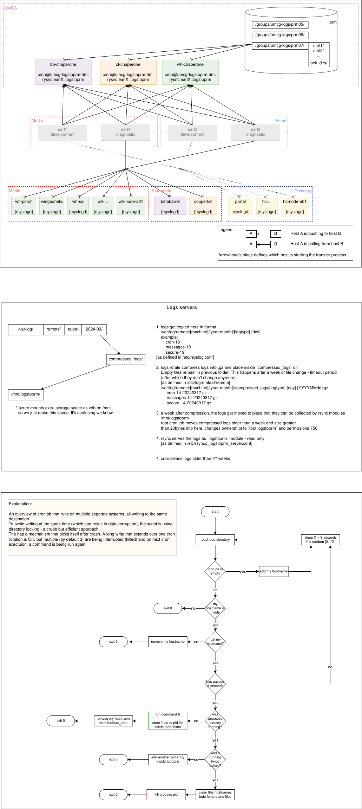

# Logs to prm role

See also

 - [Logs Clients Readme](../logs_toprm/README.md)
 - [Logs Servers Readme](../logs_server/README.md)

This role is running on the machine that has access to the `logs_server` machines.
It deploys the script that is executed with cron.
The script collects the packaged logs from the servers and stores them in the
permanent storage location.

## Deployment procedure

Order
- run this script on the chaperones
- then deploy the ansible-pipelines on the chaperon to define the crons jobs that
  trigger this script

## Deduplication

Procedure

 - since hardlinks are not reliable (cifs returns randomly values of 0 (which
   should never ever appear), 1 (no other filenames are linked to this data),
   or 2 (or more - which counts how many hardlinks in total exist, including
   counting current file),
 - therefore script collects all inodes of all files, sorts them and checks if
   there are any other with same inode, then picks the one without duplicated
   inodes (duplicated are the ones that were already processed)
 - now if there exist another same-named filename of the same system and same date
   their content is concatenated, sorted and unique values merged in place of the
   current file - found duplicated file is removed, and hardlink is created
 - if no duplicated files are found, the hardlink is created next to original file
   with appended `.duplicate` link name (effectively created a hardlink, and
   therefore these individual files will not be processed again - originally there
   are tousands of them - for every time when either of rsyslog server was offline)
 - rsync will not overwrite the current changes, as the flag to not update
   the existing files is set

## Logs

There are logs in the home folder of `~umcg-logstoprm` in two files
 - `~/logstoprm_cron.sh.cron.log` contains last cron's rsync run, and `.old` contains past 100k lines of previous runs
 - `~/deduplicate_logs.sh.log` contains logs from deduplication run and `.old` contains past 100k lines of previous runs

Scripts logs go into system logs with tag `logstoprm` > see debugging below.

## Debugging

Checking logs on the chaperone machine

   `root@chaperoneXX ~ # journalctl -t logstoprm`

